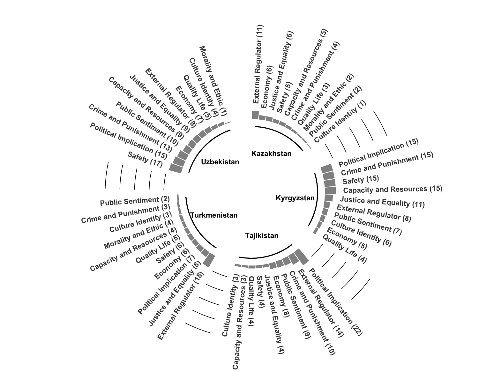
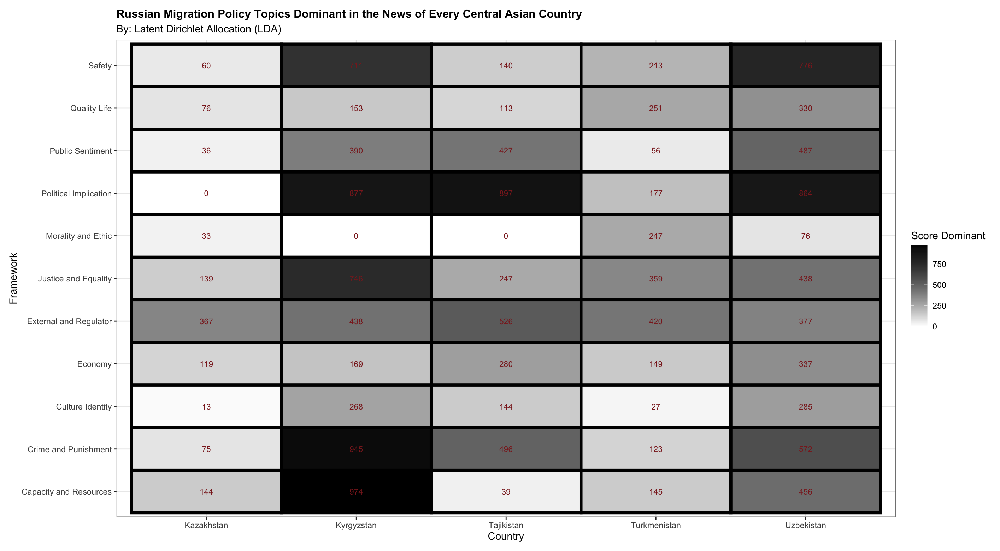

# Russian Migration Policy Discoure Central Asia News 
This project is my thesis on Russian Migration Policy Issues within the framework of Central Asian News discourse. My thesis has collected data, analyzed data, and visualized data mostly using machine learning.
Indicator research for analysis im used Issue Migration Policy according [Julia Mendelsohn, Ceren Budak, David Jurgens in Modeling Framing in Immigration Discourse on Social Media](https://aclanthology.org/2021.naacl-main.179.pdf)

| Frame                | Description                                                                 |
|----------------------|-----------------------------------------------------------------------------|
| **Economy**          | Financial problems; remittances, low wages, economic growth                 |
| **Capacity and Resources** | Physical resources and human resources availability                      |
| **Morality and Ethic** | Perspective driven by religion or sense of ethics                         |
| **Justice and Equality** | Inequality in the redistribution of law and punishment                    |
| **Crime and Punishment** | Court cases, consequences of breaking the law and implications of threats |
| **Safety**           | Safety considerations of a policy issue                                    |
| **Quality Life**     | Impact on life and life routines                                           |
| **Culture Identity** | Assimilation/Integration efforts and customs                               |
| **Public Sentiment** | Social norms, sentiments of prejudice, good and bad                        |
| **Political Implication** | Policy decisions, migrant involvement in migration policy               |
| **External Regulator** | Agreements and intergovernmental relations                                |

From the table above, analysis can be carried out to determine the indicators and variables in the analysis results.

### State of Arts
In the literature review, this thesis uses keywords based on 1,258 studies on Discourse Migration Policy. All studies were collected from the Scopus Site and created Events and keywords in VOSViewers, then the data was cleaned and produced 32 main keywords.

## 📊 Migration-Related Keywords Frequency Analysis

| Keyword                | Occurrences | Visual Representation       |
|------------------------|-------------|-----------------------------|
| **Migration**          | 472         | ████████████████████████     |
| **Immigration Policy** | 238         | █████████████                |
| **International Migration** | 147    | █████████                    |
| **Refugee**            | 103         | ██████                       |
| **Immigration**        | 115         | ██████                       |
| **Immigrant**          | 67          | ████                         |
| **Refugees**           | 64          | ████                         |
| **Political Discourse** | 58       | ███                          |
| **Immigrant Population** | 55       | ███                          |
| **Asylum Seeker**      | 52          | ███                          |
| **Human Rights**       | 57          | ███                          |
| **Forced Migration**   | 53          | ███                          |
| **Multiculturalism**   | 51          | ███                          |

<details>
<summary>📈 Show More Keywords (20+)</summary>

| Keyword                | Occurrences | Visual Representation       |
|------------------------|-------------|-----------------------------|
| **Labor Migration**    | 46          | ██                          |
| **Population Migration** | 45       | ██                          |
| **Racism**             | 41          | ██                          |
| **Migration Policy**   | 48          | ██                          |
| **Migration Experience** | 28       | █                           |
| **Borders**            | 23          | █                           |
| **Migration Determinant** | 21     | █                           |
| **Refugee Crisis**     | 24          | █                           |
| **Trafficking**        | 20          | █                           |
| **Violence**           | 16          | █                           |
| **Discrimination**     | 13          | █                           |
| **Xenophobia**         | 12          | █                           |
| **Illegal Immigrant**  | 11          | █                           |
| **Migration Crisis**   | 10          | █                           |
| **Mass Media**         | 9           | █                           |
| **Migrants Remittance** | 7        | █                           |
| **Health Worker**      | 6           | █                           |
| **Media Discourse**    | 5           | █                           |
| **Islamophobia**       | 4           | █                           |
</details>


### 📊 Keywords in Migration Policy Research

```r
library(ggplot2)
library(ggrepel)

# Create visually enhanced scatter plot of keyword frequencies
ggplot(keywordsmigrationpolicy, aes(x = Selected, y = Occurences)) +
  geom_point(aes(color = ifelse(Keyword %in% c("Media Discourse", "Mass Media"), "red", "black")),
             size = 0, alpha = 0.7) +
  
  # Smart labeling to avoid overlap
  geom_text_repel(aes(label = Keyword, 
                  color = ifelse(Keyword %in% c("Media Discourse", "Mass Media"), 
                                "red", "black")),
                  size = 3.5,
                  max.overlaps = 30,
                  box.padding = 0.5,
                  segment.color = 'grey50') +
  
  # Trend line
  geom_smooth(method = "loess", se = FALSE, color = "blue", linetype = "dashed") +
  
  # Labels and titles
  labs(title = "Keyword Frequency in Migration Policy Research",
       subtitle = "Analysis of Academic Literature (n = 1,500+ articles)",
       x = "Keyword Categories",
       y = "Frequency Count",
       caption = "Note: Media-related keywords highlighted in red") +
  
  # Visual enhancements
  ylim(min(keywordsmigrationpolicy$Occurences) - 10,
       max(keywordsmigrationpolicy$Occurences) + 10) +
  scale_color_identity() +
  theme_minimal() +
  theme(
    plot.title = element_text(face = "bold", size = 14, hjust = 0.5),
    plot.subtitle = element_text(hjust = 0.5, color = "gray40"),
    panel.grid.major = element_line(color = "gray90"),
    axis.title = element_text(face = "bold")
  )
```


Result Occurrences and keywords, this thesis create visual for showing literature about Discourse Migration Policy dominant theme research such as Migration, Immigration Policy and International Migration. So the utilization of this research keyword map is to identify gaps in migration discourse related to Media Discourse and Mass Media issues, which have not been widely discussed in previous research.


### Process Method Thesis

I have managed to collect 391 news through both screaping and manual techniques. The most news came from Kyrgyzstan, which is 101 news, followed by Uzbekistan 98 news, Tajikistan 81 news, Turkmenistan 66 news and the least is Kazakhstan 45 news.
# 📰 Distribution of Collected News Articles by Central Asian Country

| Country       | Flag | Number of Articles | Percentage | Visual Representation      |
|--------------|------|-------------------|------------|----------------------------|
| Kyrgyzstan   | 🇰🇬   | 101               | 25.8%      | ████████████████████        |
| Uzbekistan   | 🇺🇿   | 98                | 25.1%      | ███████████████████         |
| Tajikistan   | 🇹🇯   | 81                | 20.7%      | ██████████████              |
| Turkmenistan | 🇹🇲   | 66                | 16.9%      | ███████████                 |
| Kazakhstan   | 🇰🇿   | 45                | 11.5%      | ███████                     |

**Total Collected Articles**: 391  
**Collection Method**: Web scraping + manual collection  
 
### Collection News (Scraped)

```py 
import feedparser

rss_url = ""  # URL feed
feed = feedparser.parse(rss_url)

for entry in feed.entries:
    print(f"Title: {entry.title}")
    print(f"Link: {entry.link}")
    print(f"Published: {entry.published}\n")

rss_urls = ["URL News"]

entries = []

for url in rss_urls:
    feed = feedparser.parse(url)
    entries.extend(feed.entries)

print(f"Total articles retrieved: {len(entries)}")

for entry in entries[:0]:  # collection news quantity
    print(f"Title: {entry.title}")
    print(f"Link: {entry.link}")
    print(f"Published: {entry.published}\n")

```
Total articles retrieved: 0


### 📰 Read Web News Article Scraper
After getting the articles from the web page news, I will explain how to read some of the collected web page news.

```python
import requests
from bs4 import BeautifulSoup

# Sample news URLs from Central Asian sources
NEWS_URLS = [
    "https://asiaplustj.info/en/news/tajikistan/society/20240923/the-west-cautiously-extends-migrant-worker-options-for-central-asia",
    "https://timesca.com/tajik-migrants-facing-xenophobia-in-russia-after-moscow-terrorist-attack/",
    "https://www.gazeta.uz/en/2016/11/04/migration/"
]

def extract_article_data(url):
    """
    Extracts structured information from news articles
    
    Args:
        url (str): URL of the news article
        
    Returns:
        dict: Contains extracted metadata and content
    """
    try:
        response = requests.get(url, timeout=10)
        soup = BeautifulSoup(response.text, 'html.parser')
        
        return {
            "url": url,
            "title": get_meta_content(soup, 'title') or "No title found",
            "description": get_meta_content(soup, 'description') or "No description",
            "publisher": get_meta_content(soup, 'og:site_name') or "Unknown publisher",
            "first_paragraph": get_first_paragraph(soup) or "No content extracted"
        }
        
    except Exception as e:
        return {"url": url, "error": str(e)}

def get_meta_content(soup, property_name):
    """Helper to extract meta tag content"""
    tag = soup.find("meta", attrs={"name": property_name}) or \
          soup.find("meta", attrs={"property": f"og:{property_name}"})
    return tag.get("content").strip() if tag else None

def get_first_paragraph(soup):
    """Extracts the first meaningful paragraph"""
    for p in soup.find_all("p"):
        if len(p.text.strip()) > 50:  # Minimum character threshold
            return p.text.strip()
    return None

# Execute scraping
if __name__ == "__main__":
    print("🔄 Scraping Central Asian news articles...\n")
    
    results = []
    for url in NEWS_URLS:
        article = extract_article_data(url)
        results.append(article)
        
        # Print formatted output
        print(f"🌐 {article.get('publisher', 'Unknown')}")
        print(f"🔗 {article['url']}")
        print(f"📰 {article.get('title')}")
        print(f"📝 {article.get('description')}")
        print(f"➡️ Excerpt: {article.get('first_paragraph')[:150]}...")
        print("\n" + "─"*80 + "\n")

    print(f"✅ Successfully processed {len([r for r in results if 'error' not in r])}/{len(NEWS_URLS)} articles")
```
```
🔄 Scraping Central Asian news articles...

🌐 Asia-Plus
🔗 URL : https://asiaplustj.info/en/news/tajikistan/society/20240923/the-west-cautiously-extends-migrant-worker-options-for-central-asia
📰 Title : The West cautiously extends migrant worker options for Central Asia | Tajikistan News ASIA-Plus
📝 Description : No description found
➡️ First Paragraph: Radio Liberty reported on September 23 that German Chancellor Olaf Scholz was tight-lipped on the details of the migration deal that his country finalized with Uzbekistan on September 15

───────────────────────────────────────────────────────

🌐 Times of Central Asia
🔗 URL : https://timesca.com/tajik-migrants-facing-xenophobia-in-russia-after-moscow-terrorist-attack/
📰 Title :403 Forbidden
📝 Description : No description found
➡️ First Paragraph: No first paragraph found
───────────────────────────────────────────────────────

🌐 Gazeta.uz
🔗 URL : https://www.gazeta.uz/en/2016/11/04/migration/
📰 Title :403 Forbidden
📝 Description : No description found
➡️ First Paragraph: No first paragraph found

✅ Successfully processed 3/3 articles
```

### Read Web Page Error
Web page some error, and i show code if page error or problem

```python
from urllib.request import urlopen, Request
from bs4 import BeautifulSoup
import pandas as pd

# Central Asian news sources to monitor
NEWS_URLS = [
    "https://daryo.uz/en/2022/12/09/russia-lures-uzbek-migrant-workers-to-its-army-by-offering-fast-track-citizenship",
    "https://daryo.uz/en/2022/10/31/jan-sept-2022-over-300-000-russian-citizens-enter-uzbekistan"
]

# Browser headers to avoid bot detection
HEADERS = { 'User-Agent': ''}

def scrape_news_articles(url_list):
    """
    Scrape news articles from given URLs
    
    Args:
        url_list (list): List of news article URLs
        
    Returns:
        list: Dictionary of extracted article data
    """
    articles_data = []
    
    for url in url_list:
        try:
            # Send request with headers
            req = Request(url, headers=HEADERS)
            response = urlopen(req)
            html = response.read()
            
            # Parse HTML content
            soup = BeautifulSoup(html, 'html.parser')
            
            # Extract article components
            article = {
                'URL': url,
                'Title': get_article_title(soup),
                'Description': get_meta_description(soup),
                'First Paragraph': get_first_paragraph(soup),
                'Source': 'Daryo.uz'  # Can be extracted dynamically
            }
            articles_data.append(article)
            
        except Exception as e:
            print(f"⚠️ Error processing {url}: {str(e)}")
            articles_data.append({
                'URL': url,
                'Error': str(e)
            })
    
    return articles_data

def get_article_title(soup):
    """Extract article title"""
    return soup.title.string.strip() if soup.title else "No title found"

def get_meta_description(soup):
    """Extract meta description"""
    meta = soup.find('meta', attrs={'name': 'description'})
    return meta['content'].strip() if meta else "No description available"

def get_first_paragraph(soup):
    """Extract first meaningful paragraph"""
    for p in soup.find_all('p'):
        if p.text.strip() and len(p.text.strip()) > 20:
            return p.text.strip()
    return "No content found"

if __name__ == "__main__":
    print("🚀 Starting Central Asian news scraper...")
    articles = scrape_news_articles(NEWS_URLS)
    
    # Convert to DataFrame for better visualization
    df = pd.DataFrame(articles)
    print("\n📰 Scraped Articles Summary:")
    print(df[['Title', 'Source']])
```

🔄 Result Read Web Page News articles.
```
🔗: [Russia's Recruitment of Uzbek Migrants](https://daryo.uz/en/2022/12/09/russia-lures-uzbek-migrant-workers-to-its-army-by-offering-fast-track-citizenship)
**Source**: DARYO.UZ - Uzbekistan News  
**Published**: December 9, 2022  
📌 **Description**: A photo of an advertisement in Uzbek language calling for service in the Russian Armed Forces in Moscow public transport has gone viral on social media platforms.
✍️ **First Paragraph**: "A photo of an advertisement in Uzbek language calling for service in the Russian Armed Forces in Moscow public transport has gone viral on social media platforms."
---

🔗: [Russian Migration to Uzbekistan](https://daryo.uz/en/2022/10/31/jan-sept-2022-over-300-000-russian-citizens-enter-uzbekistan)
**Source**: Daryo News  
**Published**: October 31, 2022  
📌 **Description**: During the 9 months of 2022, 318,156 Russian citizens entered Uzbekistan.
✍️ **First Paragraph**: "During the 9 months of 2022, 318,156 Russian citizens entered Uzbekistan."
---
✅ Successfully read processed 2 articles
*Note: This is a sample of a larger dataset used for migration policy research.*
```

After collecting all the data in the form of titles, descriptions, and first paragraphs, I clarified all the news from the titles and narratives (descriptions), then grouped them to frame the Issue Migration Policy.

### 📊 News Analysis Framework Frequency

| Framework               | Frequency | Visualization          |
|-------------------------|-----------|------------------------|
| **External Regulator**  | 59        | ████████████████████    |
| **Political Implication** | 59      | ████████████████████    |
| **Safety**             | 47        | █████████████████        |
| **Crime and Punishment** | 45      | ████████████████         |
| **Justice and Equality** | 38      | ████████████             |
| **Capacity and Resources** | 36    | ███████████              |
| **Economy**            | 32        | ██████████               |
| **Public Sentiment**   | 30        | █████████                |
| **Quality Life**       | 21        | ██████                   |
| **Culture Identity**   | 17        | █████                    |
| **Morality and Ethnic** | 7       | ██                       |

**Total Frameworks Analyzed**: 11  
**Total Frequency Count**: 391 news articles  

### Clarifed Each Country 
The most news came from Kyrgyzstan, which was 101 news, followed by Uzbekistan with 98 news, Tajikistan with 81 news, Turkmenistan with 66 news and the least was Kazakhstan with 45 news. The news was grouped into various frameworks to describe the main themes frequently covered by Central Asian media regarding Migration Policy in Russia.

```r
  library(ggplot2)
  library(dplyr)
  
  # Data Frame
  
  data <- data.frame(
    individual = c("Political Implication", "External Regulator", "Crime and Punishment", 
                   "Public Sentiment", "Economy", "Justice and Equality", "Safety", 
                   "Quality Life", "Capacity and Resources", "Culture Identity",
                   "Political Implication", "Crime and Punishment", "Safety", 
                   "Capacity and Resources", "Justice and Equality", "External Regulator",
                   "Public Sentiment", "Culture Identity", "Economy", "Quality Life",
                   "Safety", "Political Implication", "Crime and Punishment", 
                   "Public Sentiment", "Capacity and Resources", "Justice and Equality", 
                   "External Regulator", "Economy", "Quality Life", "Culture Identity",
                   "Morality and Ethic", "External Regulator", "Justice and Equality", 
                   "Political Implication", "Economy", "Safety", "Quality Life", 
                   "Capacity and Resources", "Morality and Ethic", "Culture Identity", 
                   "Crime and Punishment", "Public Sentiment", "External Regulator", 
                   "Economy", "Justice and Equality", "Safety", "Capacity and Resources", 
                   "Crime and Punishment", "Quality Life", "Morality and Ethic", 
                   "Public Sentiment", "Culture Identity"),
    value = c(22, 14, 10, 9, 8, 4, 4, 4, 3, 3, 
              15, 15, 15, 15, 11, 8, 7, 6, 5, 4, 
              17, 15, 13, 10, 9, 9, 8, 7, 5, 4, 
              1, 18, 8, 7, 6, 6, 5, 4, 4, 3, 
              3, 2, 11, 6, 6, 5, 5, 4, 3, 2, 2, 1),
    group = c(rep("Tajikistan", 10), rep("Kyrgyzstan", 10), rep("Uzbekistan", 11), 
              rep("Turkmenistan", 11), rep("Kazakhstan", 10))
  )
  
  # Add empty bars
  empty_bar <- 3
  to_add <- data.frame(matrix(NA, empty_bar * nlevels(as.factor(data$group)), ncol(data)))
  colnames(to_add) <- colnames(data)
  to_add$group <- rep(levels(as.factor(data$group)), each = empty_bar)
  data <- rbind(data, to_add)
  data <- data %>% arrange(group)
  data$id <- seq(1, nrow(data))
  
  # Label data preparation 
  label_data <- data
  number_of_bar <- nrow(label_data)
  angle <- 90 - 360 * (label_data$id - 0.5) / number_of_bar
  label_data$hjust <- ifelse(angle < -90, 1, 0)
  label_data$angle <- ifelse(angle < -90, angle + 180, angle)
  
  # Base data for grouping
  base_data <- data %>%
    group_by(group) %>%
    summarize(start = min(id), end = max(id) - empty_bar) %>%
    rowwise() %>%
    mutate(title = mean(c(start, end)))
  
  # Grid data for scale lines
  grid_data <- base_data
  grid_data$end <- grid_data$end[c(nrow(grid_data), 1:nrow(grid_data) - 1)] + 1
  grid_data$start <- grid_data$start - 1
  grid_data <- grid_data[-1, ]
  
  p <- ggplot(data, aes(x = as.factor(id), y = value, fill = group)) +
    geom_bar(stat = "identity", alpha = 0.5, fill = "black") +
    
    # Grid lines
    geom_segment(data = grid_data, aes(x = end, y = 100, xend = start, yend = 100), 
                 colour = "black", size = 0.3, inherit.aes = FALSE) +
    geom_segment(data = grid_data, aes(x = end, y = 80, xend = start, yend = 80), 
                 colour = "black", size = 0.3, inherit.aes = FALSE) +
    geom_segment(data = grid_data, aes(x = end, y = 60, xend = start, yend = 60), 
                 colour = "black", size = 0.3, inherit.aes = FALSE) +
    geom_segment(data = grid_data, aes(x = end, y = 40, xend = start, yend = 40), 
                 colour = "black", size = 0.3, inherit.aes = FALSE) +
    geom_segment(data = grid_data, aes(x = end, y = 20, xend = start, yend = 20), 
                 colour = "black", size = 0.3, inherit.aes = FALSE) +
    
  
    # Circular bar plot
    ylim(-100, 120) +
    theme_minimal() +
    theme(
      legend.position = "none",
      axis.text = element_blank(),
      axis.title = element_blank(),
      panel.grid = element_blank(),
      plot.margin = unit(rep(-1, 4), "cm")
    ) +
    coord_polar() +
    
    # Labels for individual bars 
    # point label behind in text
    # add point upper bar
    # label point behind in text label
    geom_text(data = label_data, 
              aes(x = id, y = value + 10, label = paste0(individual, " (", value, ")"), hjust = hjust),
              color = "black", fontface = "bold", alpha = 0.8, size = 3, 
              angle = label_data$angle, inherit.aes = FALSE) +
    
    # Base lines and group titles
    geom_segment(data = base_data, 
                 aes(x = start, y = -10, xend = end, yend = -10), 
                 colour = "black", size = 0.6, inherit.aes = FALSE) +
    geom_text(data = base_data, 
              aes(x = title, y = -40, label = group),  # Turunkan y untuk lebih rapi
              hjust = 0.5,  # Center alignment
              vjust = 0.5,  # Vertikal tengah
              colour = "black", 
              size = 3, fontface = "bold", inherit.aes = FALSE)
  
  # Display the plot
  p

```



The analysis results show that the main categories that often appear are Political Implication, External regulator, and Safety. All countries generally highlight Political Implication and External Regulator as the main themes, indicating that the impact of political implications is a crucial issue in Russia's migration policy.

### Data Accurate or Dianostic Data 
During my thesis work, after classification into framework categories, I performed accurate data diagnostics and prediction of each news frame through classification statistics. Process calculate "Paragraph" and Frameworks".

```python

from sklearn.linear_model import LogisticRegression
from sklearn.feature_extraction.text import TfidfVectorizer
from sklearn.metrics import classification_report, accuracy_score
import pandas as pd

#  Load Data
df = pd.read_excel("/Users/mymac/Desktop/allnews.xlsx")

#  Data Preprocessing
df = df.dropna(subset=['Paragraph', 'Frameworks'])

# Remove classes with less than 2 samples
df = df[df['Frameworks'].map(df['Frameworks'].value_counts()) >= 2]

# TF-IDF Vectorizer
tfidf = TfidfVectorizer(stop_words='english', max_features=5000)
X = tfidf.fit_transform(df['Paragraph'])
y = df['Frameworks']

# Train Model on All Data
model = LogisticRegression(max_iter=1000, class_weight='balanced', random_state=42)
model.fit(X, y)

# Predict on the Same Data
y_pred = model.predict(X)

# Evaluate Model
print("Classification Report:")
print(classification_report(y, y_pred))
print(f"Accuracy Score: {accuracy_score(y, y_pred):.2f}")

```

### 📊 Classification Oversampling Performance Report (Accuracy: 97%)


| Framework                | Precision | Recall | F1-Score | Support | Visual Score      |
|--------------------------|-----------|--------|----------|---------|-------------------|
| **Capacity and Resources** | 1.00      | 1.00   | 1.00     | 36      | █████████████████ |
| **Crime and Punishment**  | 0.98      | 0.98   | 0.98     | 45      | ████████████████  |
| **Culture Identity**      | 1.00      | 1.00   | 1.00     | 17      | █████████████████ |
| **Economy**               | 1.00      | 0.97   | 0.98     | 32      | ████████████████  |
| **External Regulator**    | 0.93      | 0.97   | 0.95     | 59      | ██████████████    |
| **Justice and Equality**  | 1.00      | 0.92   | 0.96     | 38      | ███████████████   |
| **Morality and Ethic**    | 0.88      | 1.00   | 0.97     | 7       | ███████████████   |
| **Political Implication** | 1.00      | 0.97   | 0.98     | 59      | ████████████████  |
| **Public Sentiment**      | 0.94      | 1.00   | 0.97     | 30      | ███████████████   |
| **Quality Life**          | 0.95      | 0.95   | 0.95     | 21      | ██████████████    |
| **Safety**                | 0.96      | 0.98   | 0.97     | 47      | ███████████████   |

### Summary Statistics
| Metric          | Precision | Recall | F1-Score |
|-----------------|-----------|--------|----------|
| **Macro Avg**   | 0.97      | 0.98   | 0.97     |
| **Weighted Avg**| 0.97      | 0.97   | 0.97     |

**Total Samples**: 391  

### 🔍 Key Observations
**Perfect Performance** (1.00 F1-score):
   - Capacity and Resources
   - Culture Identity

**Highest Support Categories**:
   - External Regulator (59 samples)
   - Political Implication (59 samples)

**Most Challenging Category**:
   - Morality and Ethic (Precision: 0.88)

**Consistent Performance**:
   - 9/11 categories have F1-score ≥ 0.95

The precision results in the classification report show that almost all frames have values close to 1.00 (100%), which means that the model is rarely wrong in predicting frames. Recall also shows a high ability to detect news in each frame. F1-socre reflects the optimal balance between precision and recall


**📊Analysis Data Used four stages analysis**;
  - Laten Dirichlet Allocation(LDA)
  - Bigram Analysis 
  - Relation Narrative Framework
  - Analysis Subjectivits & Polarity
  
## Latent Dirichlet Allocation (LDA)
The Latent Dirichlet Allocation (LDA) method of this study analyzes using machine learning to produce the most dominant news distribution patterns. With an approach such as coherence score (n_components) which measures the topic narrative related to the framework. The higher the coherence score, the more relevant the narrative in one news item.

```python

import pandas as pd
from sklearn.feature_extraction.text import CountVectorizer
from sklearn.decomposition import LatentDirichletAllocation

# callculate each country - i just showing from Uzbekistan Media
data = pd.read_excel("/Users/mymac/Desktop/Uzbekistan_News_Media copy.xlsx")


# processing text and clening text
def preprocess_text(text):
    text = text.lower()  #  change small words
    text = re.sub(r'[^a-z\s]', '', text)  # delete number 
    return text
  
# Must not have NaN in coulumns 'description'
data['Paragraph'] = data['Paragraph'].fillna('')  # change NaN with string empty

# save decsription in variable
Paragraph = data['Paragraph']


import re

# implementation to columns 'description'
Paragraph = Paragraph.apply(preprocess_text)


# Vectorize teks
vectorizer = CountVectorizer(stop_words='english')  # delete stop words
X = vectorizer.fit_transform(Paragraph)  # Hasilkan bag-of-words

# LDA
lda = LatentDirichletAllocation(n_components=101, random_state=42)  # choose topic
lda.fit(X)

#  showing dominant topic and dominant text
n_top_words = 10  # summary words want to showing
feature_names = vectorizer.get_feature_names_out()  #  get fiture (words)

for topic_idx, topic in enumerate(lda.components_):
    print(f"Topik {topic_idx + 1}:")
    top_words = [feature_names[i] for i in topic.argsort()[:-n_top_words - 1:-1]]
    print(" ".join(top_words))

# Distribution topic for each document
theta = lda.transform(X)  # n_documents x n_topics
print(pd.DataFrame(theta, columns=[f"Topic {i+1}" for i in range(lda.n_components)]))

# Dominant topict each document
dominant_topics = theta.argmax(axis=1)  # Index topic with highest probility 
data['Dominant_Topic'] = dominant_topics + 1  # Indeks start form 0, so add 1
print(data[['Paragraph', 'Dominant_Topic']])

```
```
>>> print(data[['Paragraph', 'Dominant_Topic']])
                                            Paragraph  Dominant_Topic
0   The flow of labor migrants from Uzbekistan to ...              37
1   The Agency for External Labor Migration has as...              19
2   Delegation of the Ministry of Labour of Uzbeki...              37
3   Russia’s Ministry of Internal Affairs (MIA) pr...              29
4   Russia remains the main destination country fo...              25
..                                                ...             ...
93  According to reports from the Migration Agency...              18
94  The corresponding decree was signed by the reg...              34
95  Citizens of Uzbekistan residing in Russia and ...              87
96  Earlier, the news spread on social networks th...              27
97  Authorities in the Voronezh region reported th...              61

[98 rows x 2 columns]

After got Dominant Topic, i made Heat Map visual for result dominant topic each country

```

```r

library(readxl)
  Analysis_frame_Heatmap <- read_excel("Desktop/Reseacrh Immigrant/Analysis_frame_Heatmap.xlsx")
  View(Analysis_frame_Heatmap)
  
  library(ggplot2)
  ggplot(heatmap, aes(x = Country, y = Framework, fill = `Score Dominant`))+
    geom_tile(colour = "black", linewidth=1.5)+
    scale_fill_gradient(low = "white", high = "black") +
    geom_text(aes(label = round(`Score Dominant`, 2)), color = 'brown4', size = 3) +
    theme_bw() +
    labs(title = "Russian Migration Policy Topics Dominant in the News of Every Central Asian Country",
         subtitle ="By: Latent Dirichlet Allocation (LDA)")+
    theme(plot.title = element_text(face = "bold")) +
    theme(plot.title = element_text(face = "bold", size = 12),
          plot.subtitle = element_text(size = 11),
          plot.caption = element_text(size = 10, hjust = 0)) +
    theme(plot.margin = margin(t = 10, r = 10, b = 10, l = 10))
  
```


The results of the study show that the most dominant topic is Political Implications, which is the main focus of almost all Central Asian countries except Kazakhstan. Kazakhstan and Uzbekistan have a more even distribution of frameworks compared to Kyrgyzstan, where Political Implications are very dominant. The case shows that Russian policies have a direct impact on all aspects of migrants' lives

## Bigram Text Analysis
The following data analysis using the Bigram model aims to identify patterns and dominant word groups from all news. This model groups words that appear frequently (frequency) to simplify the narrative. 

```py

import pandas as pd  
from sklearn.feature_extraction.text import CountVectorizer  
from nltk.corpus import stopwords  
import nltk  
  
# install stopwords dari NLTK (just one time to run)  
nltk.download('stopwords')  
  
# Dataframe  
data = pd.read_excel("/Users/mymac/Downloads/alldominant.xlsx")  
df = pd.DataFrame(data)  
  
# Preprocessing: Lowercase and remove punctuation  
df['Paragraph_cleaned'] = df['Paragraph'].str.lower().str.replace(r'[^\w\s]', '', regex=True)  
  
# Define stopwords  
stop_words = stopwords.words('english')  # using stopwords dari NLTK  
  
# Function to extract bigrams  
def extract_bigrams(text):  
    vectorizer = CountVectorizer(ngram_range=(4, 4), stop_words='english')  # using 'english' sebagai stopwords  
    bigrams = vectorizer.fit_transform([text])  
    bigram_freq = zip(vectorizer.get_feature_names_out(), bigrams.toarray()[0])  
    return sorted(bigram_freq, key=lambda x: x[1], reverse=True)  
  
# Apply bigram extraction per Framework  
results = {}  
for framework in df['Framework'].unique():  
    combined_text = " ".join(df[df['Framework'] == framework]['Paragraph_cleaned'])  
    results[framework] = extract_bigrams(combined_text)  
  
# Display results  
for framework, bigrams in results.items():  
    print(f"Top bigrams for Framework: {framework}")  
    for bigram, freq in bigrams[:2]:  # Top 5 bigrams  
        print(f"{bigram}: {freq}")  
    print()  

```

```

Top bigrams for Framework: Safety 
foreign labor migration agency: 14
labor migration agency issued: 6

Top bigrams for Framework: Political Implication
russian president vladimir putin: 5
foreign citizens stateless persons: 3

Top bigrams for Framework: Crime and Punishment
russian ministry internal affairs: 4
foreign citizens stateless persons: 3

Top bigrams for Framework: Culture Identity 
16 telegram channel published: 1
20 focusing extremism risks: 1

Top bigrams for Framework: Public Sentiment
2008 indicator tripled reports: 2
47 survey participants russian: 2

Top bigrams for Framework: Justice and Equality
banned entering country years: 2
ministry internal affairs russia: 2

Top bigrams for Framework: Quality Life
120000 tajik citizens suspected: 2
ago russian authorities published: 2

Top bigrams for Framework: External Regulator
republic kazakhstan russian federation: 4
bilateral cooperation exchanged views: 3

Top bigrams for Framework: Economy
agency external labor migration: 2
tajik labor migrants russia: 2

Top bigrams for Framework: Capacity and Resources
applicants opportunity receive higher: 3
bilateral relations russia turkmenistan: 3

Top bigrams for Framework: Morality and Ethic
20 organizer faces years: 1
2022 regular air traffic: 1

Top bigrams for Framework: Economy 
02 mln transferred russia: 1
095 mln outgoing transfers: 1

Top bigrams for Framework: Culture Identity
minister education russian federation: 2
1000 educational methodological books: 1

Top bigrams for Framework: Safety
crocus city hall march: 4
22 thousands people came: 3


```
After getting the data analysis from Bigram, I made improvements between the framework and the Bigram narrative in the form of a table. Each framework I gave 6 texts that have high frequency and emotional narratives and are related to the framework.


### Bigram Analysis by Theme: Analysis of Central Asian Media Discourse on Russian Migrants

| Framework               | Top Bigrams                                                                 | Key Insights                                                                 |
|------------------------|-----------------------------------------------------------------------------|------------------------------------------------------------------------------|
| **Security**           | `current attack crocus city`, `terrorist attack 14 people`                 | Focus on terrorist threats and military operations involving migrants        |
| **Cultural Identity**  | `adaptation course labor migrants`, `knowledge russian language foreigners` | Cultural/language adaptation as primary challenges                          |
| **Quality of Life**    | `novel salaries russia higher`, `175 migrants receive payments`            | Economic benefits but require health monitoring systems                     |
| **Capacity**           | `89 million labor migrants`, `foreigners talented young people`            | Significant human capital potential for development                         |
| **Political Impact**   | `2024 services passport visa`, `legislation regarding protection workers`  | Visa policies and worker protection as political issues                     |
| **Public Sentiment**   | `labor migration positive phenomenon`, `fear increase strongholds society` | Polarized views: both support and growing xenophobia                        |
| **External Regulation**| `traditionally inherent kazakhrasian relations`, `bilateral cooperation`   | Bilateral agreements shaping migration policies                             |
| **Morality & Ethics**  | `sympathy solidarity families friends`, `money organized illegal visits`   | Ethical dilemmas between solidarity vs. exploitation                        |
| **Crime**              | `296 foreign citizens illegally`, `crackdown illegal migrants`             | Law enforcement against illegal migration and human trafficking              |
| **Economy**            | `countries highest shares remittances`, `remittances labor migrants`       | Migrant remittances as significant economic contributors                    |

From the results of the Bigram analysis that connects the frameworks and news narratives, it was found that the Safety framework has the highest frequency, with narratives such as "terrorist attack crocus city" and "caution light recent military". This shows that the Safety framework is more associated with the issue of terrorism threats and military activities. Than i created analysis Relation Narrative Framework, aims for find any frameworks into news narrative. 
