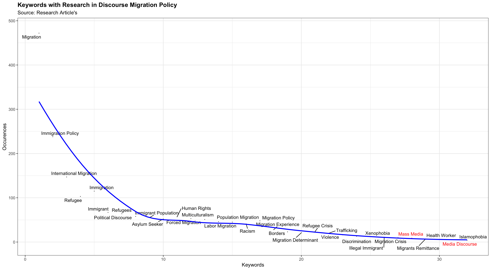

# Russian Migration Policy Discoure Central Asia News
This project is my thesis on Russian Migration Policy Issues within the framework of Central Asian News discourse. My thesis has collected data, analyzed data, and visualized data mostly using machine learning.
Indicator research for analysis im used Issue Migration Policy according [Julia Mendelsohn, Ceren Budak, David Jurgens in Modeling Framing in Immigration Discourse on Social Media](https://aclanthology.org/2021.naacl-main.179.pdf)

| Frame                | Description                                                                 |
|----------------------|-----------------------------------------------------------------------------|
| **Economy**          | Financial problems; remittances, low wages, economic growth                 |
| **Capacity and Resources** | Physical resources and human resources availability                      |
| **Morality and Ethic** | Perspective driven by religion or sense of ethics                         |
| **Justice and Equality** | Inequality in the redistribution of law and punishment                    |
| **Crime and Punishment** | Court cases, consequences of breaking the law and implications of threats |
| **Safety**           | Safety considerations of a policy issue                                    |
| **Quality Life**     | Impact on life and life routines                                           |
| **Culture Identity** | Assimilation/Integration efforts and customs                               |
| **Public Sentiment** | Social norms, sentiments of prejudice, good and bad                        |
| **Political Implication** | Policy decisions, migrant involvement in migration policy               |
| **External Regulator** | Agreements and intergovernmental relations                                |

From the table above, analysis can be carried out to determine the indicators and variables in the analysis results.

### State of Arts
In the literature review, this thesis uses keywords based on 1,258 studies on Discourse Migration Policy. All studies were collected from the Scopus Site and created Events and keywords in VOSViewers, then the data was cleaned and produced 32 main keywords.

## 📊 Migration-Related Keywords Frequency Analysis

| Keyword                | Occurrences | Visual Representation       |
|------------------------|-------------|-----------------------------|
| **Migration**          | 472         | ████████████████████████     |
| **Immigration Policy** | 238         | █████████████                |
| **International Migration** | 147    | █████████                    |
| **Refugee**            | 103         | ██████                       |
| **Immigration**        | 115         | ██████                       |
| **Immigrant**          | 67          | ████                         |
| **Refugees**           | 64          | ████                         |
| **Political Discourse** | 58       | ███                          |
| **Immigrant Population** | 55       | ███                          |
| **Asylum Seeker**      | 52          | ███                          |
| **Human Rights**       | 57          | ███                          |
| **Forced Migration**   | 53          | ███                          |
| **Multiculturalism**   | 51          | ███                          |

<details>
<summary>📈 Show More Keywords (20+)</summary>

| Keyword                | Occurrences | Visual Representation       |
|------------------------|-------------|-----------------------------|
| **Labor Migration**    | 46          | ██                          |
| **Population Migration** | 45       | ██                          |
| **Racism**             | 41          | ██                          |
| **Migration Policy**   | 48          | ██                          |
| **Migration Experience** | 28       | █                           |
| **Borders**            | 23          | █                           |
| **Migration Determinant** | 21     | █                           |
| **Refugee Crisis**     | 24          | █                           |
| **Trafficking**        | 20          | █                           |
| **Violence**           | 16          | █                           |
| **Discrimination**     | 13          | █                           |
| **Xenophobia**         | 12          | █                           |
| **Illegal Immigrant**  | 11          | █                           |
| **Migration Crisis**   | 10          | █                           |
| **Mass Media**         | 9           | █                           |
| **Migrants Remittance** | 7        | █                           |
| **Health Worker**      | 6           | █                           |
| **Media Discourse**    | 5           | █                           |
| **Islamophobia**       | 4           | █                           |
</details>


### 📊 Keywords in Migration Policy Research

```r
library(ggplot2)
library(ggrepel)

# Create visually enhanced scatter plot of keyword frequencies
ggplot(keywordsmigrationpolicy, aes(x = Selected, y = Occurences)) +
  geom_point(aes(color = ifelse(Keyword %in% c("Media Discourse", "Mass Media"), "red", "black")),
             size = 0, alpha = 0.7) +
  
  # Smart labeling to avoid overlap
  geom_text_repel(aes(label = Keyword, 
                  color = ifelse(Keyword %in% c("Media Discourse", "Mass Media"), 
                                "red", "black")),
                  size = 3.5,
                  max.overlaps = 30,
                  box.padding = 0.5,
                  segment.color = 'grey50') +
  
  # Trend line
  geom_smooth(method = "loess", se = FALSE, color = "blue", linetype = "dashed") +
  
  # Labels and titles
  labs(title = "Keyword Frequency in Migration Policy Research",
       subtitle = "Analysis of Academic Literature (n = 1,500+ articles)",
       x = "Keyword Categories",
       y = "Frequency Count",
       caption = "Note: Media-related keywords highlighted in red") +
  
  # Visual enhancements
  ylim(min(keywordsmigrationpolicy$Occurences) - 10,
       max(keywordsmigrationpolicy$Occurences) + 10) +
  scale_color_identity() +
  theme_minimal() +
  theme(
    plot.title = element_text(face = "bold", size = 14, hjust = 0.5),
    plot.subtitle = element_text(hjust = 0.5, color = "gray40"),
    panel.grid.major = element_line(color = "gray90"),
    axis.title = element_text(face = "bold")
  )
```



Result Occurrences and keywords, this thesis create visual for showing literature about Discourse Migration Policy dominant theme research such as Migration, Immigration Policy and International Migration. So the utilization of this research keyword map is to identify gaps in migration discourse related to Media Discourse and Mass Media issues, which have not been widely discussed in previous research.


### Process Method Thesis

I have managed to collect 391 news through both screaping and manual techniques. The most news came from Kyrgyzstan, which is 101 news, followed by Uzbekistan 98 news, Tajikistan 81 news, Turkmenistan 66 news and the least is Kazakhstan 45 news.
# 📰 Distribution of Collected News Articles by Central Asian Country

| Country       | Flag | Number of Articles | Percentage | Visual Representation      |
|--------------|------|-------------------|------------|----------------------------|
| Kyrgyzstan   | 🇰🇬   | 101               | 25.8%      | ████████████████████        |
| Uzbekistan   | 🇺🇿   | 98                | 25.1%      | ███████████████████         |
| Tajikistan   | 🇹🇯   | 81                | 20.7%      | ██████████████              |
| Turkmenistan | 🇹🇲   | 66                | 16.9%      | ███████████                 |
| Kazakhstan   | 🇰🇿   | 45                | 11.5%      | ███████                     |

**Total Collected Articles**: 391  
**Collection Method**: Web scraping + manual collection  
 
### Collection News (Scraped)

```py 
import feedparser

rss_url = ""  # URL feed
feed = feedparser.parse(rss_url)

for entry in feed.entries:
    print(f"Title: {entry.title}")
    print(f"Link: {entry.link}")
    print(f"Published: {entry.published}\n")

rss_urls = ["URL News"]

entries = []

for url in rss_urls:
    feed = feedparser.parse(url)
    entries.extend(feed.entries)

print(f"Total articles retrieved: {len(entries)}")

for entry in entries[:0]:  # collection news quantity
    print(f"Title: {entry.title}")
    print(f"Link: {entry.link}")
    print(f"Published: {entry.published}\n")

```
Total articles retrieved: 0
